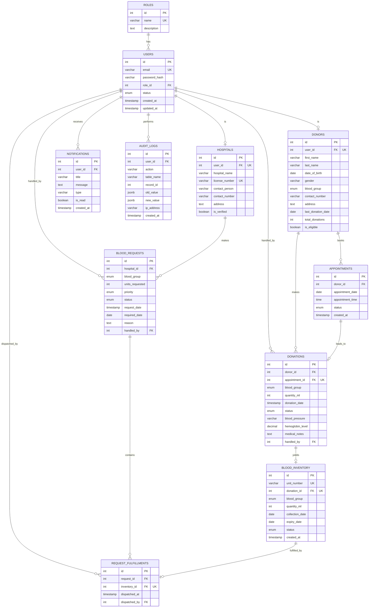

# Entity Relationship (ER) Diagram

```mermaid
erDiagram
    ROLES {
        int id PK
        varchar name UK
        text description
    }
    
    USERS {
        int id PK
        varchar email UK
        varchar password_hash
        int role_id FK
        enum status
        timestamp created_at
        timestamp updated_at
    }

    DONORS {
        int id PK
        int user_id FK "UK"
        varchar first_name
        varchar last_name
        date date_of_birth
        varchar gender
        enum blood_group
        varchar contact_number
        text address
        date last_donation_date
        int total_donations
        boolean is_eligible
    }

    HOSPITALS {
        int id PK
        int user_id FK "UK"
        varchar hospital_name
        varchar license_number UK
        varchar contact_person
        varchar contact_number
        text address
        boolean is_verified
    }

    APPOINTMENTS {
        int id PK
        int donor_id FK
        date appointment_date
        time appointment_time
        enum status
        timestamp created_at
    }

    DONATIONS {
        int id PK
        int donor_id FK
        int appointment_id FK "UK"
        enum blood_group
        int quantity_ml
        timestamp donation_date
        enum status
        varchar blood_pressure
        decimal hemoglobin_level
        text medical_notes
        int handled_by FK
    }

    BLOOD_INVENTORY {
        int id PK
        varchar unit_number UK
        int donation_id FK "UK"
        enum blood_group
        int quantity_ml
        date collection_date
        date expiry_date
        enum status
        timestamp created_at
    }

    BLOOD_REQUESTS {
        int id PK
        int hospital_id FK
        enum blood_group
        int units_requested
        enum priority
        enum status
        timestamp request_date
        date required_date
        text reason
        int handled_by FK
    }

    REQUEST_FULFILLMENTS {
        int id PK
        int request_id FK
        int inventory_id FK "UK"
        timestamp dispatched_at
        int dispatched_by FK
    }

    NOTIFICATIONS {
        int id PK
        int user_id FK
        varchar title
        text message
        varchar type
        boolean is_read
        timestamp created_at
    }

    AUDIT_LOGS {
        int id PK
        int user_id FK
        varchar action
        varchar table_name
        int record_id
        jsonb old_value
        jsonb new_value
        varchar ip_address
        timestamp created_at
    }

    %% Relationships
    ROLES ||--o{ USERS : "has"
    USERS ||--o| DONORS : "is"
    USERS ||--o| HOSPITALS : "is"
    USERS ||--o{ DONATIONS : "handled_by"
    USERS ||--o{ BLOOD_REQUESTS : "handled_by"
    USERS ||--o{ REQUEST_FULFILLMENTS : "dispatched_by"
    USERS ||--o{ NOTIFICATIONS : "receives"
    USERS ||--o{ AUDIT_LOGS : "performs"
    
    DONORS ||--o{ APPOINTMENTS : "books"
    DONORS ||--o{ DONATIONS : "makes"
    APPOINTMENTS ||--o| DONATIONS : "leads_to"
    
    DONATIONS ||--o| BLOOD_INVENTORY : "yields"
    
    HOSPITALS ||--o{ BLOOD_REQUESTS : "makes"
    
    BLOOD_REQUESTS ||--o{ REQUEST_FULFILLMENTS : "contains"
    BLOOD_INVENTORY ||--o| REQUEST_FULFILLMENTS : "fulfilled_by"
```
